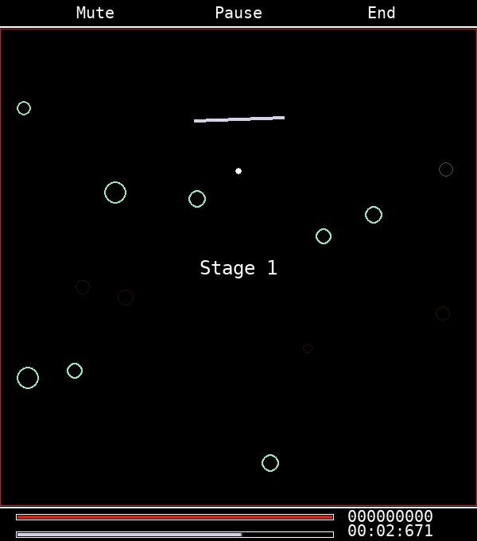
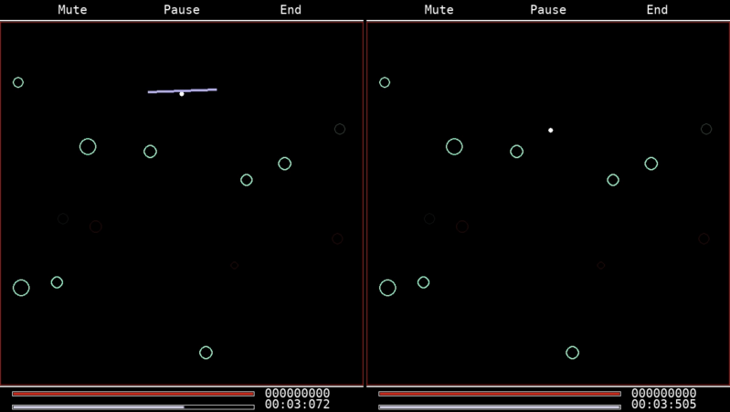
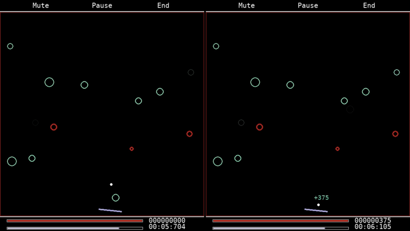
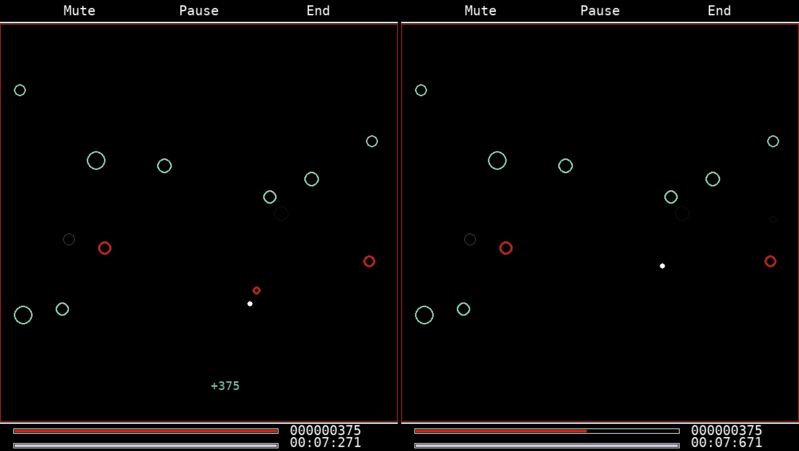
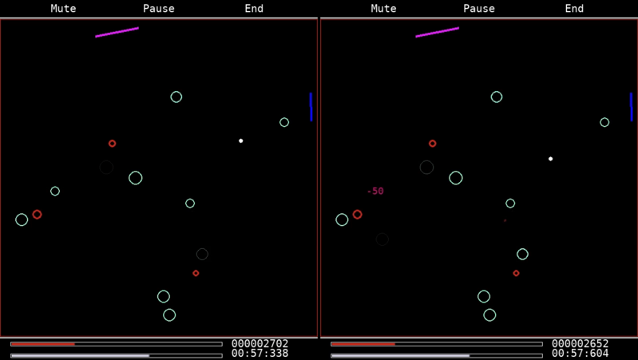
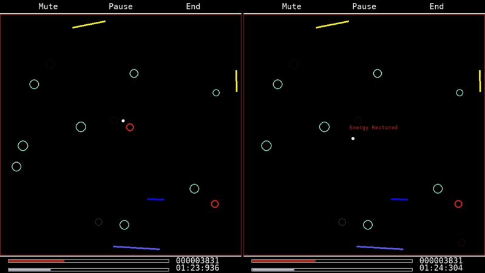
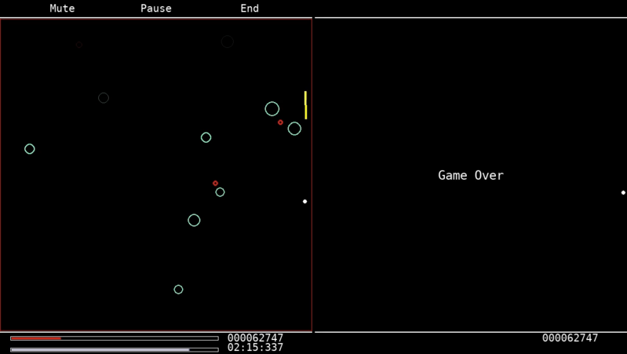

# Spherebounce

## Overview



Spherebounce is a [Python](https://www.python.org/) game in which you draw walls to make a sphere bounce around the screen and collect green rings for points.

## Requirements

[pygame](https://www.pygame.org/docs/)

## Usage

```cmd
git init  
git pull https://github.com/ntntnldmg/spherebounce master  
cd src  
python main.py
```

## Features



Drawing walls exhausts the tank displayed at the bottom of the screen but is necessary to steer the ball.



Collecting green rings adds points to the score.



Hitting the edge or a red ring deals damage to the energybar displayed at the bottom of the screen.



If uncollected, green rings expire after a while, diminishing the score.



Passing a red ring very closely restores a bit of energy.



When all energy is lost, the game is over.

## Contact

If you have suggestions or feedback, feel free to contact me at <ntntnldmg@gmail.com>.
